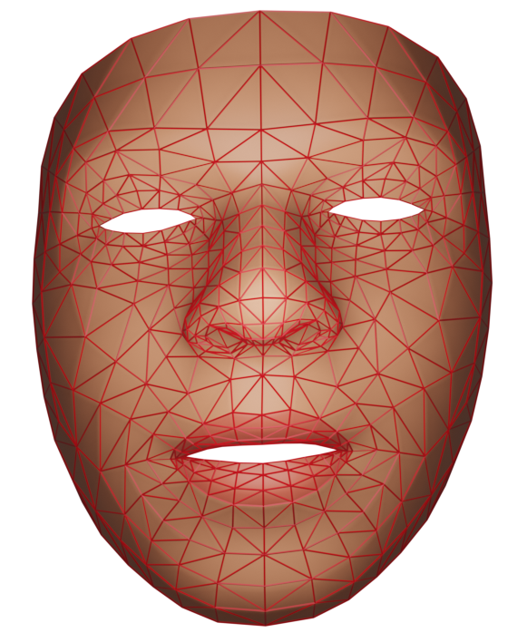

# Lip synchronization model for the Tamil language

    

    

 Our model predicts 3D face animation for a given Tamil audio speech with considering the coarticulation effects. Our model achieved a Root Mean Square Error of 0.0648 in our test data split and achieved an 83% of overall subjective accuracy. Further, the Turing test confirmed that participants were unable to distinguish our predicted animation from the ground.

### Results

<table>
  <tr>
    <td>
      
      
SHORT SPEECH

    </td>
    <td>
      
      
LONG SPEECH

    </td>
  </tr>
  <tr>
    <td>
      
      
FAST SPEECH

    </td>
    <td>
      
      
SLOW SPEECH

    </td>
  </tr>
  <tr>
    <td>
      
      
MIXED LANGUAGE SPEECH

    </td>
  </tr>
</table>

### Required packages & libraries

- `librosa 0.8.1`
- `ffmpeg 4.3.1 `
- `opencv-python 4.5.2`
- `scipy 1.6.2`
- `tensorflow 2.6.0`
- `sklearn 0.22.2`
- `Blender 2.92.0`
- `pickle 4.0`
- `numpy 1.20.0`
- `matplotlib 3.3.4`
- `tqdm 4.59.0`
- `keras-tuner 1.1.2`
- `mediapipe 0.8.9.1`

### Model training

- Place all recorded training videos inside VIDEOs directory
- Run `PDM.py` and `Preprocess.py` in the specified order to perform feature extraction
- Run `HyperparameterTuning.py` to pick best possible hyperparameter combination (optional)
- Set the best hyperparameter values in the `BLSTM_128_64.py` file (optional)
- Run `BLSTM_128_64.py` to train the deeplearning model

### Model prediction

- Record the input Tamil speech audio and place it inside the `VIDEOs/AUDIOs/` directory
- Set Blender path in Prediction.py in `cmd` variable
- Run command `python Prediction.py <fileName> <audioFormat>` to generate animation

### Pre-trained model

To try our trained model download the preporocessor and model weights from [WeightsAndPreprocessor.zip](https://drive.google.com/file/d/1nRPOQnRJTJzOf20rFS7lXZzyWpGL69mQ/view?usp=sharing) and unzip them inside the `logs` directory

###### python implementation will be published soon after publishing the research paper.